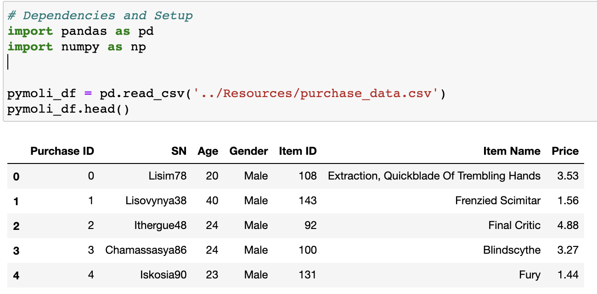
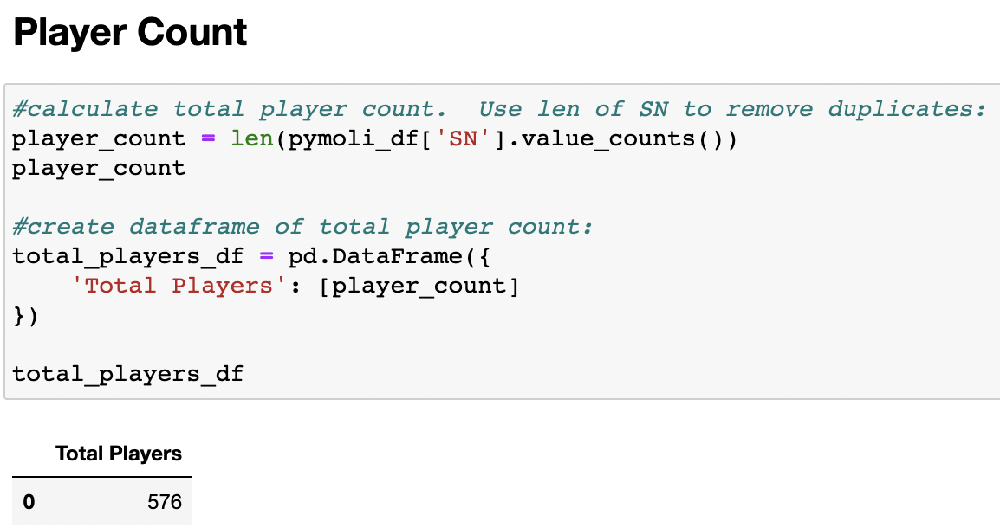
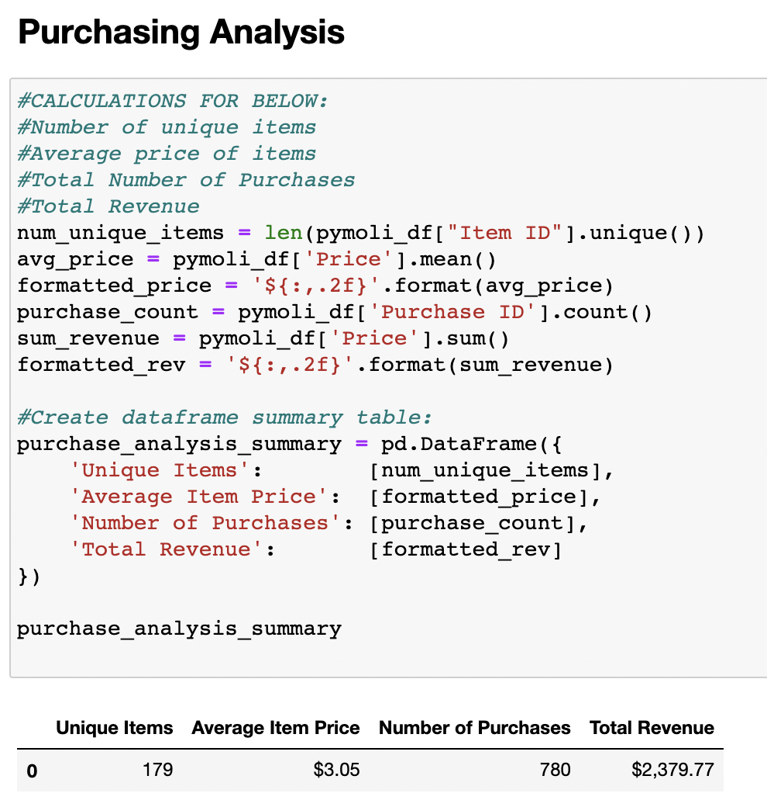
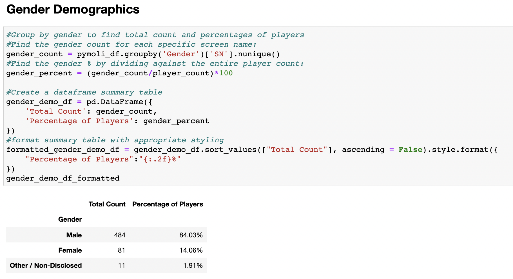
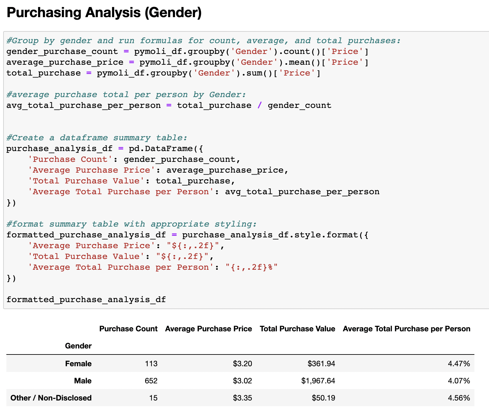
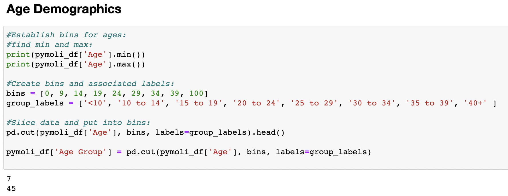
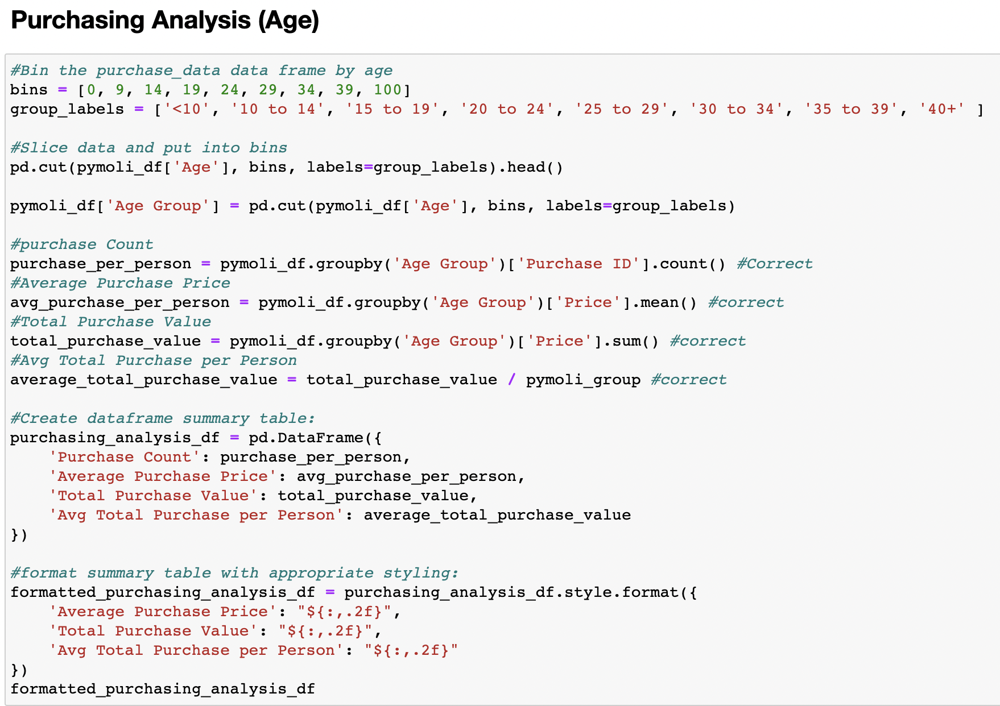
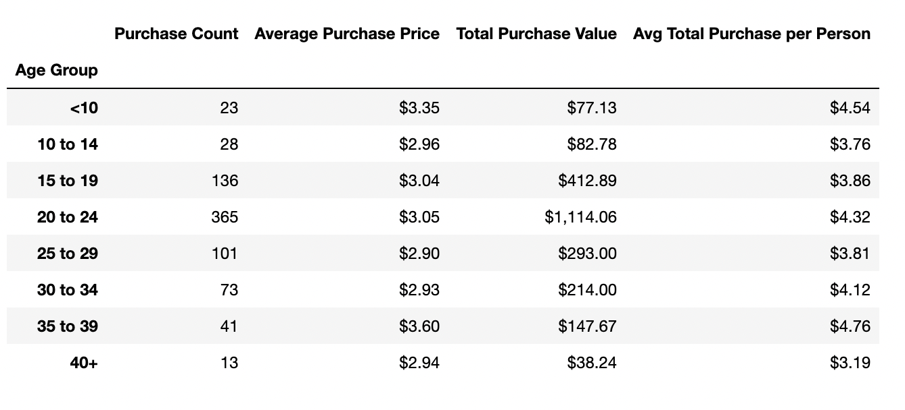
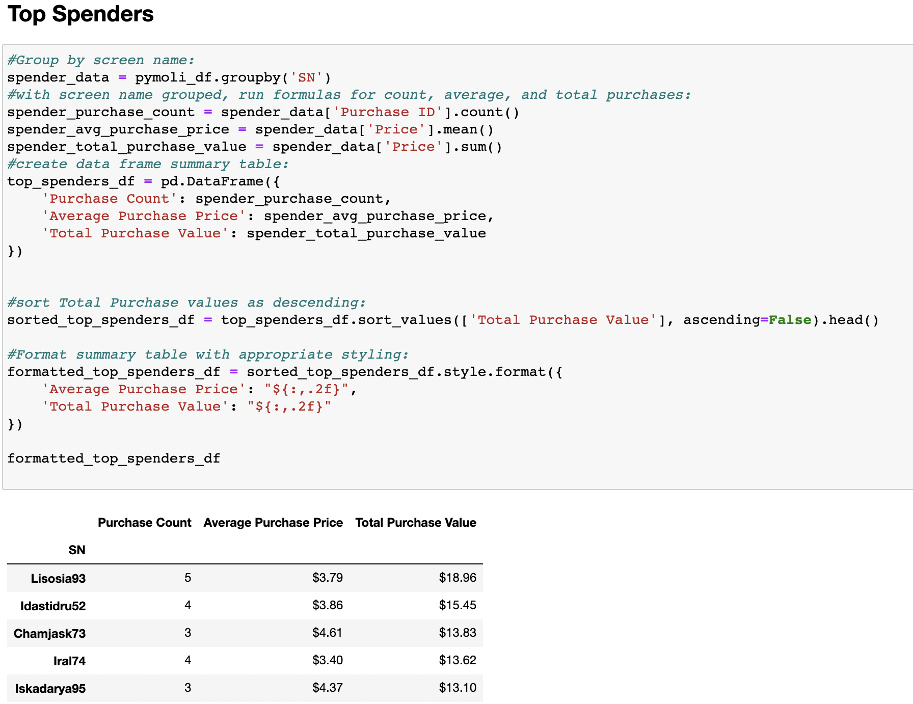

Below are individual break downs of user demographics and purchasing data into meaningful insights.

  Before any analysis could be completed the dependencies needed to manipulate the           data were imported.  Next, using Pandas the CSV containing the data was read and the first data frame was created. 

 
 
    

 
 
  <strong>Player Count</strong>
<ul>
  <li>Total Player Count</li>
</ul>

 
 

 
<strong>Purchasing Analysis (Total)</strong>
<ul>
  <li>Number of Unique Items</li>
  <li>Average Purchase Price</li>
  <li>Total Number of Purchases</li>
  <li>Total Revenue</li>
</ul>

 
 

 
  <strong>Gender Demographics</strong>
<ul>
  <li>Percentage and Count of Male Players</li>
  <li>Percentage and Count of Female Players</li>
  <li>Percentage and Count of Other / Non-Disclosed</li>
</ul>

 
 

 
<strong>Purchasing Analysis (Gender)</strong>
<ul>
  <li>The below each broken by gender</li>
    <ul>
      <li>Purchase Count</li>
      <li>Average Purchase Price</li>
      <li>Total Purchase Value</li>
      <li>Average Purchase Total per Person by Gender</li>
    </ul>
</ul>

 
 

 
<strong>Age Demographics</strong>
<ul>
  <li>The below each broken into bins of 4 years (i.e. <10, 10-14, 15-19, etc.)</li>
  <ul>
    <li>Purchase Count</li>
    <li>Average Purchase Price</li>
    <li>Total Purchase Value</li>
    <li>Average Purchase Total per Person by Age Group</li>
  </ul>
</ul>

 
 

 
  
  

 
  <strong>Top Spenders</strong>
<ul>
  <li>Identify the the top 5 spenders in the game by total purchase value, then listed in a table:</li>
    <ul>
      <li>SN</li>
      <li>Purchase Count</li>
      <li>Average Purchase Price</li>
      <li>Total Purchase Value</li>
    </ul>
</ul>

 
 

------------------TEMPLATE - COPY ONLY ---------------

 
  <strong>TITLE</strong>
<ul>
  <li>text</li>
    
  <li>text</li>
  <li>text</li>
  <li>text</li>
  <li>text</li>
  <li>text</li>
  <li>text</li>
</ul>

 
 

